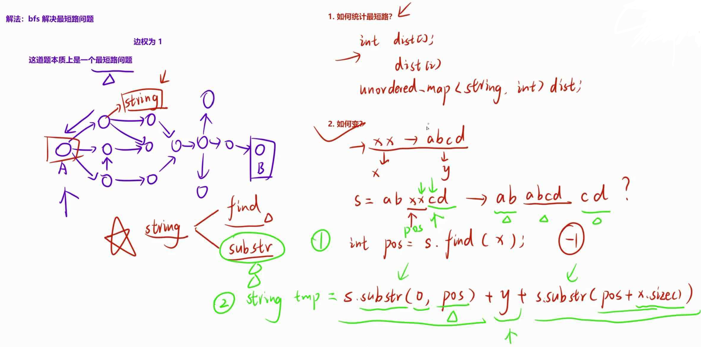
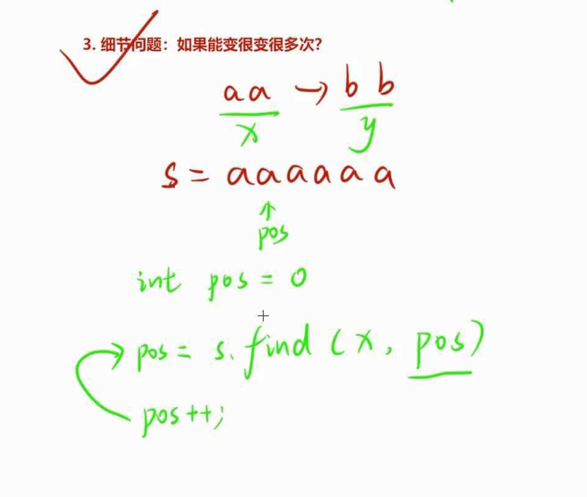
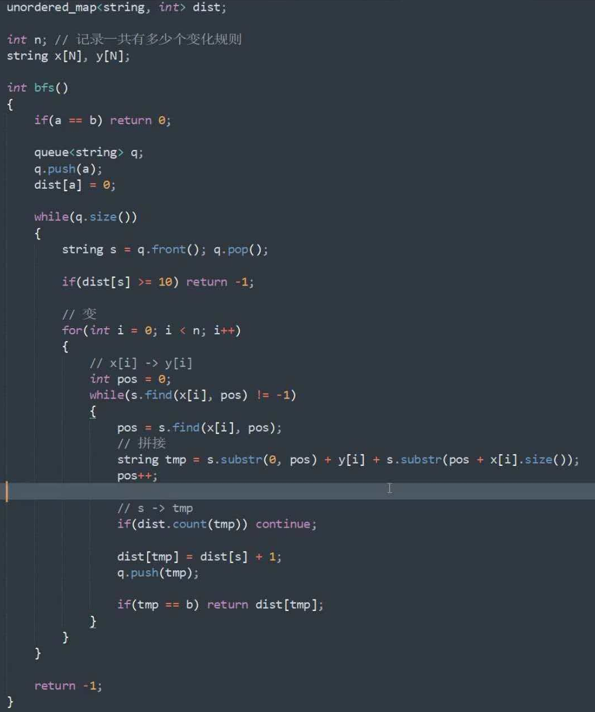

## 分析
- 最短路问题，边权为1，bfs
- 如何统计最短路？int dist[N]->unorder_map<string,int>mp;以string为下标
- 如何变

  - 拼接
  
  - replace
string& replace (size_t pos,  size_t len,  const string& str)
第一个为替换起始位置，被替换部分长度，替换字符串
- 如果变很多次

~~~cpp
 for(int i=1;i<=pos;i++)
    {
        
      
      int start=0;
      //可能now中含有多个a[i];
      while ((start=tmp.find(x[i],start))!=-1)
      {
        
       string now=tmp;//每次需要重置为起始
        now.replace(start,x[i].size(),y[i]);
        start++;
        if(dist.count(now))continue;//之前加入过了
        dist[now]=dist[tmp]+1;
        if(now==b)return dist[now];//找到了
        q.push(now);
        //now=tmp;//同理需要重置，应该放在最后重置,// 【悲剧发生】：被 continue 截胡了，这行代码根本没执行！
      }
      
    }
~~~
 - while处采用tmp.find,now字符串回更改，通过改变start，找出多个可更改位置