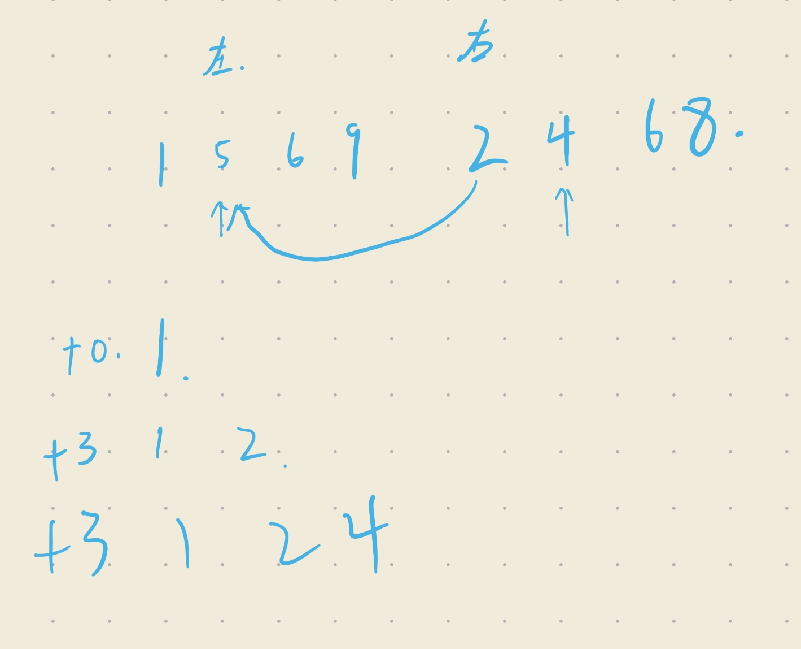

# 题解

## 排序本质：消除逆序对
- 冒泡排序，交换一次，ret++;超时

## 解决
- 分治，归并排序

## 错误分析
- 返回值匹配，ll ret累加，返回值为int发生截断
- 合并求逆序对错误

应该为
~~~cpp
ret+=(mid-cur1+1);
~~~
相当于将一个数已经交换后放在正确位置，剩下继续比较剩下的，且因为有序
- tmp数组起始位置，为l，后续拷贝
~~~cpp
for(int i=l;i<pos;i++)a[i]=tmp[i];//起始
//也可为
for(int i=l;i<=r;i++)a[i]=tmp[i];
~~~