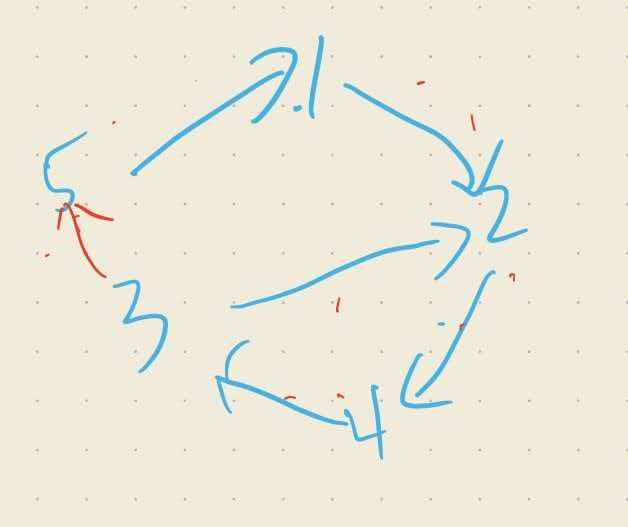

## 分析
- 分析可得，获得自己信息，必须有环

如图蓝色为示例，需要三轮
- 可是如果存在多个环，例如连接3->5，此时我们就需要找最小环
本体出度为1，不存在环与环嵌套
  - 出度限制为 1 的图（本题）：不可能嵌套，放心用你的拓扑 DFS，极其高效。

  - 出度大于 1 的通用图：不能用 st 标记的 DFS，必须改用全局 BFS 或 Floyd 算法。

- 使用拓扑排序，找到环
- 用dfs/bfs找到最小环，对每个节点使用一次

## 错误分析
- 未考虑到有多个环，仅仅将入度为0排除
~~~cpp
//找到最小环大小
#include <iostream>
#include <queue>
#include <vector>
using namespace std;
typedef long long ll;
typedef unsigned long long ull;
typedef pair<int,int>PII;
int INF=0x3f3f3f3f;
const int N = 1e6 + 10;
int n;
int a[N];
vector<int>edge[N];
int in[N];
int main() {

  ios::sync_with_stdio(false);
  cin.tie(nullptr);
  int n;
  cin>>n;
  for(int i=1;i<=n;i++)
  {
    int t;cin>>t;

    edge[i].push_back(t);
    in[t]++;
  }
queue<int>q;
for(int i=1;i<=n;i++)
{
  if(in[i]==0)q.push(i);
}
while (q.size())
{
    int a=q.front();q.pop();
    n--;
    for(auto&e:edge[a])
    {
      in[e]--;
      if(in[e]==0)q.push(e);
    }
}
cout<<n;
  return 0;
}
~~~
仅能得30分