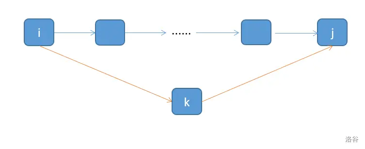

# 题解

## 分析
- 最小环起点不固定，使用Floyd
- 存在很多环，使用ans记录最小环边权和
- 环需要满足起点终点一致
- 算法思路：在Floyd算法的计算过程中，我们可以取小于k的两个节点i,j。若i,j与k之间均有边，则存在一个可能的最小环 i-j-k (因为i,j之间的路径长度为只经过1-(k-1)号节点的最短路径)。 

~~~cpp
for(int k=1;k<=n;k++){
		
        for(int i=1;i<=n;i++){
			
            for(int j=1;j<=n;j++){
				
                if(i!=j&&g[i][k]>0&&g[k][j]>0)
                ans=min(ans,d[i][j]+g[i][k]+g[k][j]);
	if(d[i][k]+d[k][j]<d[i][j])
                d[i][j] = d[i][k]+d[k][j];
			}
		}
	}
~~~