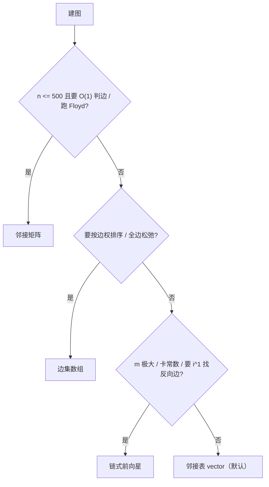

# 图论 (Graph Theory)

> 本目录复习索引。**看完能回答三件事**：这题该用哪种存法？建模要加什么虚拟结构？模板能不能盲写？

---

## 一、建图方式（四种存法）

| 存法 | 代码形状 | 空间 | 适合 |
|---|---|---|---|
| 邻接矩阵 | `int g[N][N]` | $O(n^2)$ | $n\le500$ 稠密图；Floyd；**需要 $O(1)$ 判"两点间是否有边"** |
| 邻接表（vector） | `vector<PII> g[N]` | $O(n+m)$ | **最通用**，默认选它 |
| 链式前向星 | `h/ne/to/w[]` | $O(n+m)$ | $m$ 很大、卡常数、**需要"反向边配对 `i^1`"**（找桥、网络流） |
| 边集数组 | `struct{int u,v,w;}st[M]` | $O(m)$ | **按边权排序**（Kruskal）、全边松弛（Bellman-Ford） |

### ① 邻接矩阵

```cpp
int f[510][510];
memset(f, 0x3f, sizeof f);
for (int i = 1; i <= m; i++) {
    int a, b, w; cin >> a >> b >> w;
    f[a][b] = f[b][a] = min(f[a][b], w);   // 无向 + 重边取 min
}
for (int i = 1; i <= n; i++) f[i][i] = 0;
```

- 自环、重边都在建图时处理掉（取 min）
- 上限：$5000^2\times4\text{B}=100\text{MB}$ ✗ → 矩阵基本只配 Floyd

### ② 邻接表（vector）

```cpp
vector<PII> g[N];                 // (to, w)；不带权用 vector<int> g[N]
g[a].push_back({b, w});
// 无向再加 g[b].push_back({a, w});

for (auto& [to, w] : g[u]) { /* 松弛 */ }
```

- **重边不需要预处理**：都存进去，松弛时自然取最优
- ⚠️ **多组数据必须 `for (int i = 1; i <= n; i++) g[i].clear();`** —— `g->clear()` 只清 `g[0]`（已踩）

### ③ 链式前向星

```cpp
int h[N], to[M], ne[M], w[M], idx = 2;    // 从 2 开始，保证成对
void add(int u, int v, int ww) {
    to[idx] = v; w[idx] = ww; ne[idx] = h[u]; h[u] = idx++;
}
add(u, v, w); add(v, u, w);               // 无向 = 两条，编号相邻

for (int i = h[u]; i; i = ne[i]) { int v = to[i], ww = w[i]; }
```

- 边 $i$ 的反向边是 **`i^1`**（偶数起点的意义就在这里）
- **`M` 要开 $2m$**（无向图）

### ④ 边集数组

```cpp
struct node { int x, y, w; } st[M];
sort(st + 1, st + 1 + m, [](node& a, node& b){ return a.w < b.w; });
```

- 只服务于"按边权排序"或"每轮遍历所有边"

### 选哪种？决策流程



---

## 二、建图前先问三句

1. **$n$ 多大？** → 决定矩阵还是表（$n>2000$ 基本告别矩阵）
2. **$m$ 多大？** → 决定 vector 还是链式前向星
3. **我要不要**：① $O(1)$ 判边存在 ② 按边权排序 ③ 找某条边的反向边？
   → 分别指向 矩阵 / 边集数组 / 链式前向星

---

## 三、建模技巧（建图 ≠ 只存边，这里才是考点）

| 技巧 | 什么时候用 | 目录里对应题目 |
|---|---|---|
| **反向图** | "求所有点到某点距离"：正图跑一遍 = 反图从终点跑一遍 | P1629 邮递员送信 |
| **虚拟源点/超级源** | 多起点最短路；把"单独买"变成一个点连所有商品的 0/权值边 | P1194 买礼物 |
| **分层图** | 有"免费跳 $k$ 次 / 最多换 $k$ 次"限制：建 $k+1$ 层 | （待补） |
| **拆点** | 点有容量、点有通过代价：入点 + 出点中间加边 | （待补） |
| **隐式图（不建图）** | 网格、棋盘、状态题：BFS 时直接枚举相邻状态 | （待补） |
| **坐标/字符串 → 编号** | 点不是 $1..n$ 时用 `map` 或排序去重映射 | P2712 摄像头 |
| **树** | 无向图 + DFS，靠 `fa` 防回头 | Tree/ 目录 |

---

## 四、建图常见坑

- **数组开小**：无向图链式前向星要 $2m$；只开 $m$ → RE/WA
- **`const int N = 1e6 + 10` 一律开大**：MLE 时无从下手，按题反推真实规模
- **多组数据 vector 忘 clear**
- **边权/距离溢出**：$\sum w$ 可超 `int`，用 `ll`
- **`INF` 加法溢出**：用 `0x1f1f1f1f` 而不是 `0x3f3f3f3f`（两张表相加时更安全，见 P6175 写法）
- **下标基准混用**：读入 1-indexed、内部 0-indexed 最容易错
- **用 `INF` 当"无解"哨兵**：`ret == INF` 判空有风险（答案理论上可能撞上，或累加溢出成 INF）。更稳的是**另用计数器表达"是否存在"**（Kruskal 用 `cnt == n-1`）

---

## 五、题目清单（我已写的题）

### 单源最短路 `single_source_shortest/`

| 文件 | 考点/要点 |
|---|---|
| `Bellman-ford_Algorithm.cpp` | 模板：$n-1$ 轮全边松弛；第 $n$ 轮还能松弛 ⟹ 负环 |
| `Spfa.cpp` | 模板：队列版 BF，dist 变优才入队 |
| `P_3371_模板_单源最短路径_弱化版` | 朴素 Dijkstra $O(n^2)$ |
| `P_4779_模板_单源最短路径_标准版` | **堆优化 Dijkstra**；考点：数据卡 SPFA |
| `P_3385_模板_负环` | SPFA 判负环：`cnt[i] >= n` 即有负环 |
| `P_1144_最短路计数` | 最短路 DAG 上计数（`f[]` 累加，注意重边会重复计数） |
| `P_1629_邮递员送信` | **反向图**：去程正图 + 回程反图 |
| `P_1744_采购特价商品` | 坐标算欧氏距离 + 最短路（**`double` 边权**） |
| `P_2136_拉近距离` | 负边权 → 只能 BF/SPFA |

### 多源 & Floyd `multi-Source_Shortest_Path/`

| 文件 | 考点/要点 |
|---|---|
| `B_3647_模板_Floyd` | Floyd 模板：`f[i][i]=0`、重边取 min |
| `P_2910_Clear_And_Present_Danger_S` | Floyd 当**预处理工具**，再按访问序列累加 |
| `P_1119_灾后重建` | **按时间依次加点**跑 Floyd：理解 $k$ 是"允许的中转点集合" |
| `P_6175_无向图的最小环问题` | Floyd 求最小环：**边表与最短路表必须分开** |

### 最小生成树 `minimum_spanning_tree/`

| 文件 | 考点/要点 |
|---|---|
| `Kruskal_Algorithm.cpp` / `Prim_Algorithm.cpp` | 两个模板（Kruskal 用边集 + 并查集） |
| `P_3366_模板_最小生成树` | 模板题 |
| `P_1194_买礼物` | MST 变形：优惠关系建模 + 单独买价 |
| `P_2330_繁忙的都市` | **最小瓶颈生成树**：MST 上最大的边权 |
| `P_2573_滑雪` | **带约束的 MST**：高度决定单向可达，先定向再 Kruskal，并统计可达点数 |

### 拓扑排序 `topological_sorting/`

| 文件 | 考点/要点 |
|---|---|
| `B_3644_模板_拓扑排序_家谱树` | 模板：入度为 0 入队 |
| `P_1113_杂务` | 拓扑 + DP（求最早完成时间 = DAG 最长路） |
| `P_4017_最大食物链计数` | 拓扑 + **DP 计数**（入度填表、出度汇总） |
| `P_2712_摄像头` | 拓扑 + `map` 编号映射（⚠️ AI 辅助版本，**建议自己重写**） |

---

## 六、精选复习题

### 🥇 第一档：骨架，必须**盲写**出来

| 题目 | 复习目标 | 自检问题 |
|---|---|---|
| **P4779** 单源最短路（标准版） | 堆优化 Dijkstra 盲写 | `st[]` 是干嘛的？为什么出堆时才是最终距离？ |
| **P3385** 负环 | SPFA 判负环 | 为什么 `cnt[i] >= n`？BF 版的判据是什么？ |
| **P3366** 最小生成树 | Kruskal 盲写（并查集+排序） | 为什么 Kruskal 一定对？`cnt == n-1` 为什么是判连通条件？ |
| **B3644** 家谱树 | 拓扑排序盲写 | 什么图没有拓扑序？ |

### 🥈 第二档：建模技巧（最值钱，一题一技巧）

| 题目 | 复习目标 | 自检问题 |
|---|---|---|
| **P1629** 邮递员送信 | **反向图** | 为什么反图只跑一遍就能得到"所有点→起点"的距离？ |
| **P6175** 无向图的最小环 | Floyd 的 $k$ 语义 | 为什么边表 `edge[][]` 和 `f[][]` **必须分开**？合在一起会出什么错？ |
| **P1119** 灾后重建 | 按时间加点跑 Floyd | Floyd 的 $k$ 到底"允许"了什么？ |
| **P4017** 最大食物链计数 | 拓扑 + DP 计数 | 起点/终点怎么定义？为什么用入度填表？ |

### 🥉 第三档：变形与易错（二刷用）

| 题目 | 复习目标 | 自检问题 |
|---|---|---|
| **P1144** 最短路计数 | 最短路 DAG 计数 | **重边**会不会导致重复计数？你 `vector` 存重边时怎么处理？ |
| **P2330** 繁忙的都市 | 最小瓶颈生成树 | 为什么"最后加入的那条边"就是最小瓶颈？ |
| **P2573** 滑雪 | 约束下的 MST | 为什么先按高度排序/定向？可达点数怎么统计？ |
| **P1194** 买礼物 | 虚拟源点/超级源 | 单独买的价钱怎么变成一条边？ |
| **P2910** Clear And Present Danger | Floyd 当预处理 | 为什么不能对每对相邻访问点各跑一次 Dijkstra？复杂度差多少？ |
| **P2136** 拉近距离 | 负权/负环 | 有负边权时 Dijkstra 为什么失效？ |
| **P1744** 采购特价商品 | 几何 + 最短路 | `double` 边权要注意什么？ |
| **P2712** 摄像头 | 拓扑 + 编号映射 | 自己重写一遍（AI 版不算会） |

---

## 七、复习节奏（3 天）

```
Day 1  骨架: 盲写 Dijkstra(堆) / SPFA / Kruskal / 拓扑  → 各跑一遍 P4779、P3385、P3366、B3644
Day 2  技巧: P1629(反图) → P6175(最小环) → P1119(加点Floyd) → P4017(拓扑DP)
Day 3  变形: P1144(计数+重边) → P2330(瓶颈) → P2573(约束MST) → P1194(虚拟源点)
           每做完一题,在 attention.txt 写一行"错因/关键观察"
```

**完成标准**：每道精选题不看题解能独立 AC，且能**口述**"为什么这么做"，而不是"我记得这么做"。

---

## 八、还没覆盖的（下一步）参考训练计划

- **分层图最短路**（$k$ 次免费/优惠）
- **差分约束**（SPFA 判负环的进阶用法）
- **SCC 缩点 / Tarjan**
- **二分图判定与匈牙利匹配**
- **树上问题**：直径、LCA、树上差分（见 `Tree/`）
