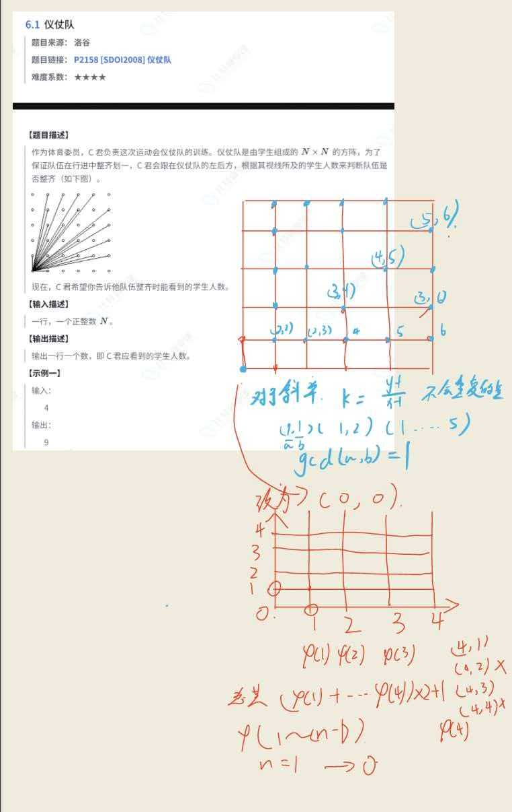

## 分析

## 错误回放
- 重定义n，局部优先，导致，n错误；
- 欧拉筛，忘记标记合数
- 标记合数时
   - 当i%p[j]==0时，说明x=i*p[j],phi[x]=p[j]*phi[i],因为i包含了x所有质因数
   - !=0时，互质，直接利用积性函数性质，相乘
   ~~~cpp
     //phi[x]=(p[j]-1)*phi[i];
        phi[x]=phi[p[j]]*phi[i];
   ~~~