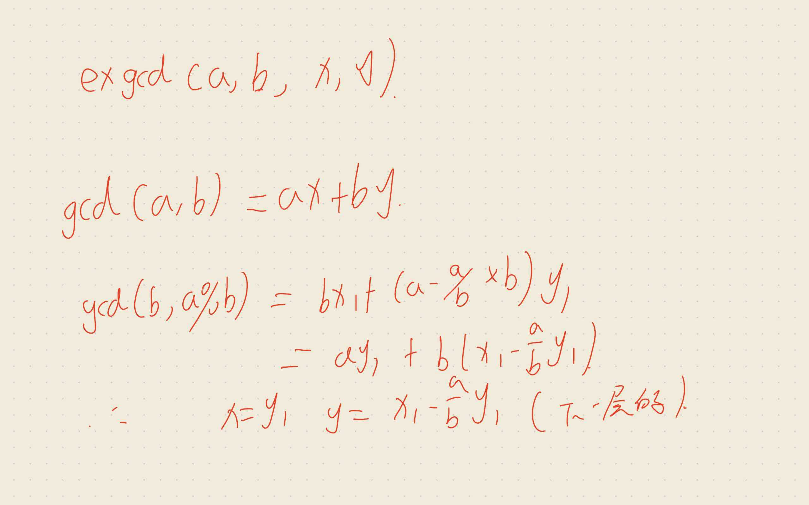
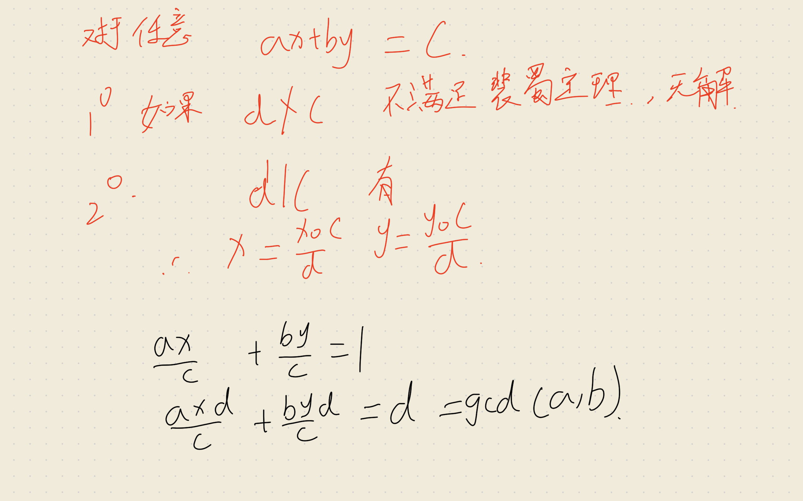
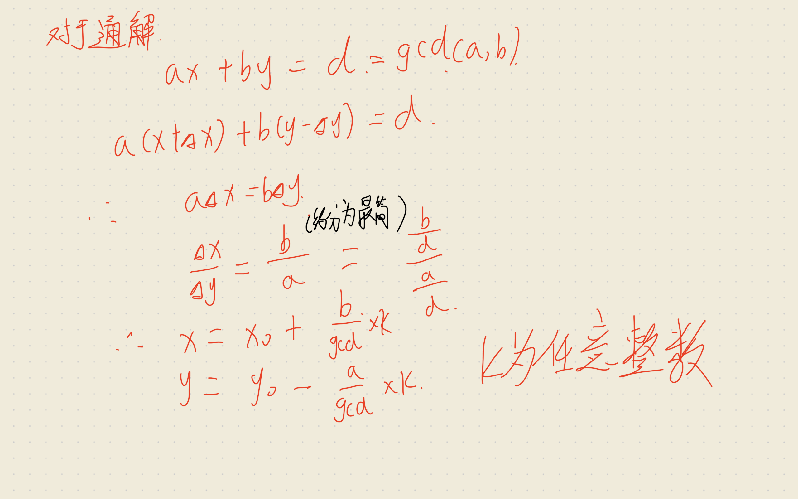
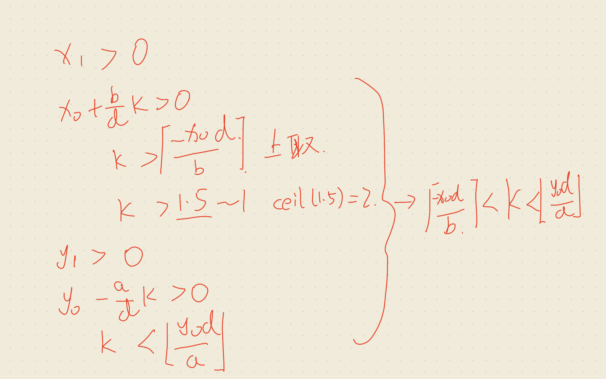
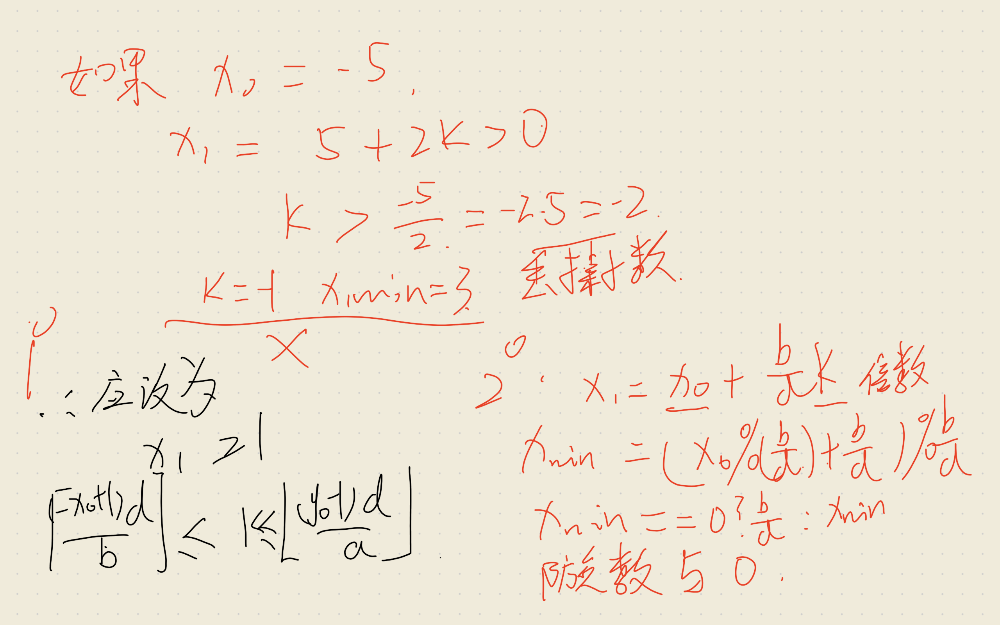
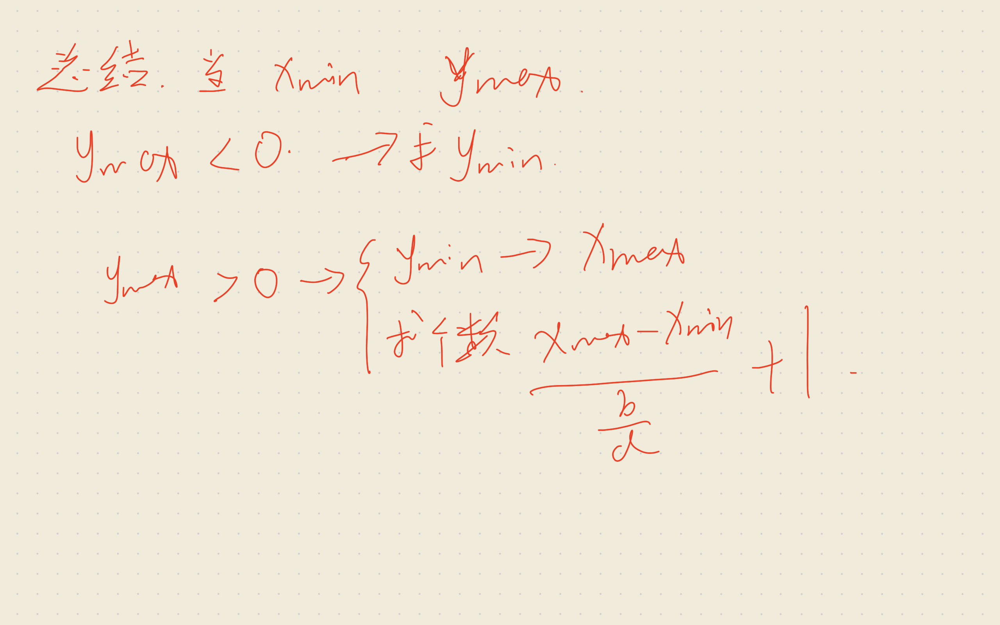

## 错误分析
- gcd返回值为a，写成了1
- ceil与floor取值，对double类型
  - 在 C++ 中，-x + 1 是整数（long long），dx 也是整数。
当计算机执行 (-x+1)/dx 时，它会先执行纯整数除法（向零取整，直接砍掉小数）。
也就是说，如果算出来本该是 -2.5，它在这一步就已经变成了 -2。
然后，它才把 -2 喂给 ceil() 函数。ceil(-2) 算出来依然是 -2。
这就导致你用的 ceil 和 floor 完全成了摆设，完全没有起到“向上/向下取整”的作用！
    ~~~cpp
    ll k1 = ceil((double)(-x + 1) / dx); // ✅ 强制转为 double
    ll k2 = floor((double)(y - 1) / dy); // ✅ 强制转为 double
    ~~~