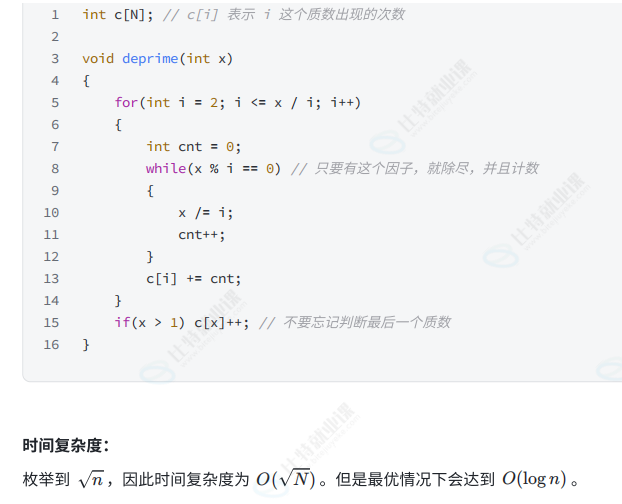
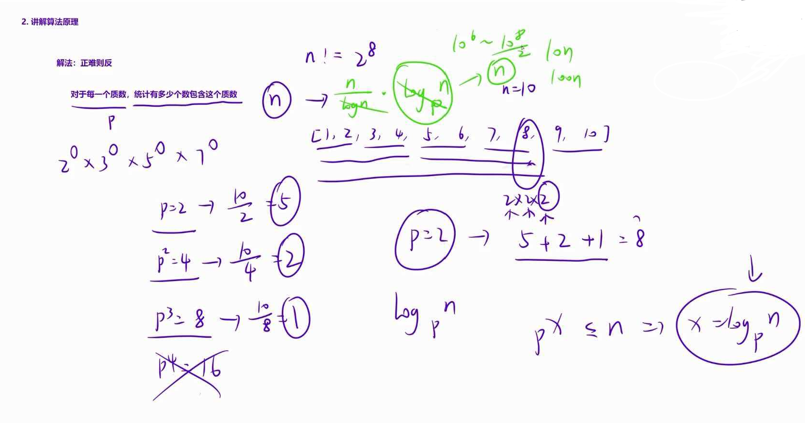
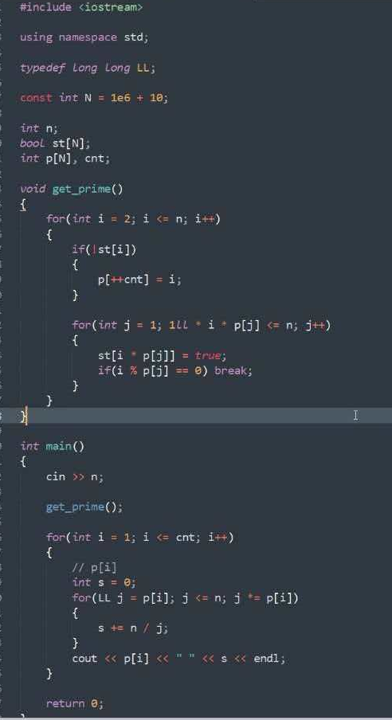
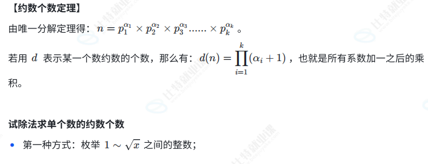
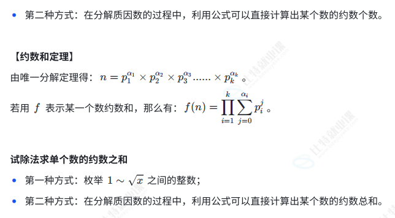
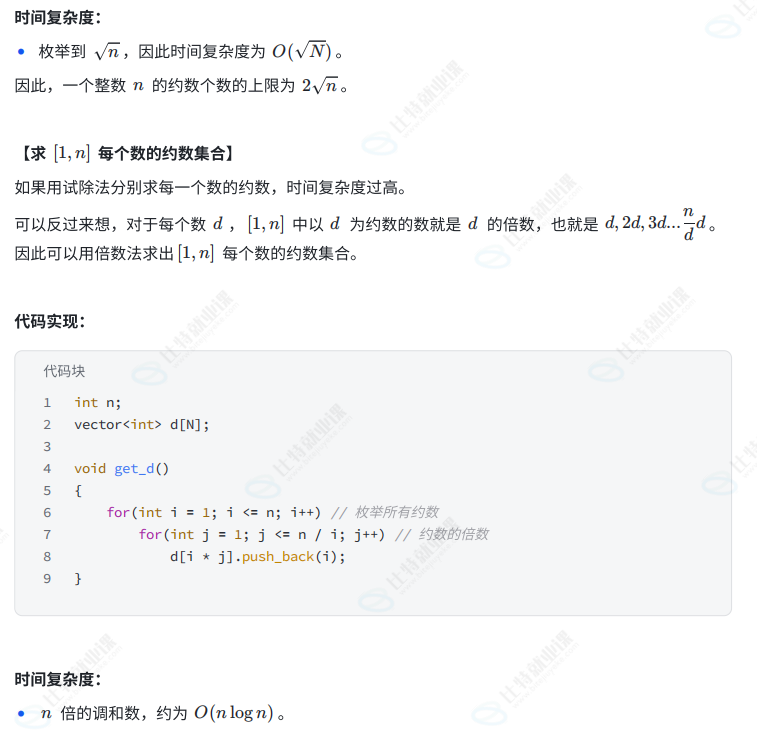
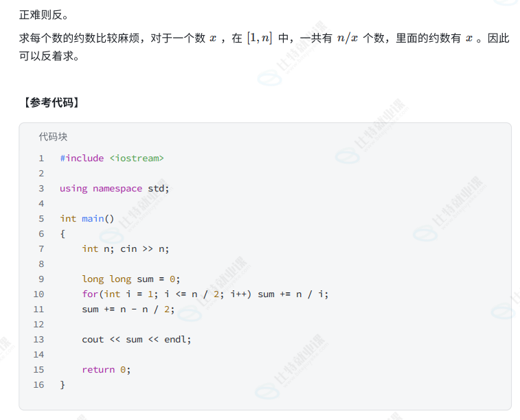

## 分解质因数

### 对于阶乘分解质因数
- 对于每个数单独分解
- 
- 对于每一个质数，找有多少个包含这个数

假如n=10
10/2=5；去掉第一个2，10/4，去掉第二个2；
4=2*2需要筛两遍，10/2筛掉第一个2，10/4筛掉第二个2

## 约数个数与约数之和

### 注意
- 约数总是成对存在，d|n,同时n/d|n，如果d与d/n不同即为两个  约数之和优化
- ⼀个整数 n 的约数个数的上限为 2$\sqrt{n}$
- 试除法
  - 复杂度O($\sqrt{n}$) 
  - 单独求一个数约数
- 倍数法

## 求解约数个数和
