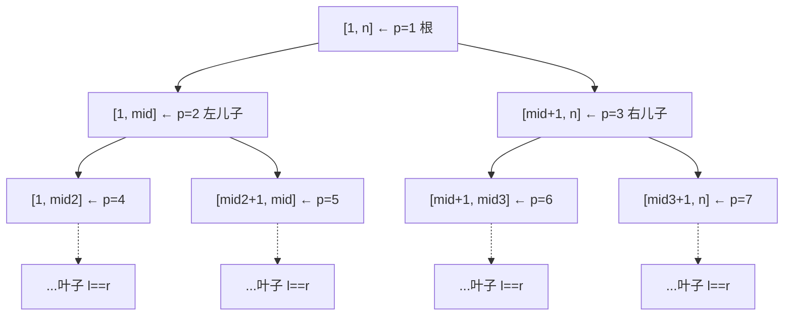
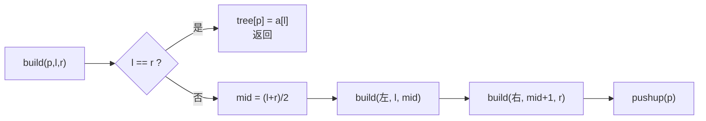
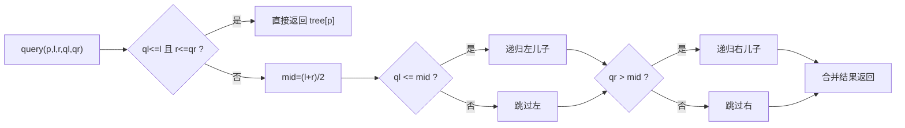
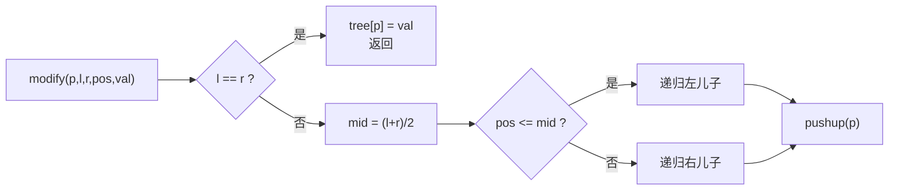
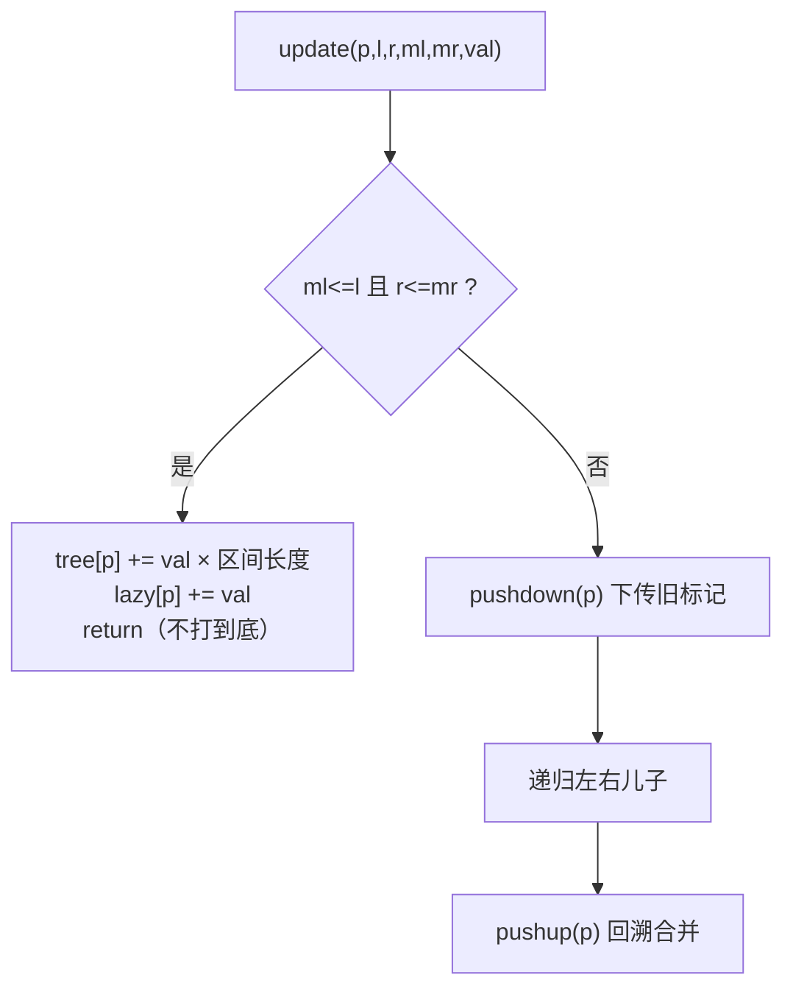
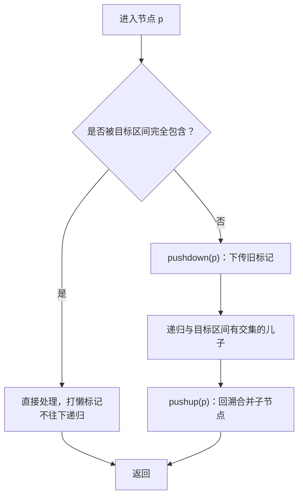

# 线段树 (Segment Tree)

## 一、使用场景

| 场景 | n 范围 | q 范围 | 操作 |
|------|--------|--------|------|
| 静态区间求和 | n ≤ 10⁵ | q ≤ 10⁵ | 询问区间 [l, r] 的和 |
| 单点修改 + 区间查询 | n ≤ 10⁵ | q ≤ 10⁵ | ① 查询 [l, r] 的和；② 将第 i 个数改为 x |
| 区间修改 + 区间查询 | n ≤ 10⁵ | q ≤ 10⁵ | ① 查询 [l, r] 的和；② 将 [l, r] 全部改为 x |
| RMQ（区间最值） | n ≤ 10⁵ | q ≤ 10⁵ | 询问区间 [l, r] 的最大值/最小值 |

> 以上问题暴力解法 O(nq) 会超时，线段树可以在 **O(log n)** 内完成每次操作。

---

## 二、核心概念

线段树是一棵**二叉树**，用来维护**区间信息**：

- 根节点覆盖整个数组区间 `[1, n]`
- 每个节点 `p` 维护一个区间 `[l, r]`，设 `mid = (l + r) / 2`：
  - **左儿子** `p*2` 维护 `[l, mid]`
  - **右儿子** `p*2+1` 维护 `[mid+1, r]`
- 叶子节点 `l == r` 时对应原数组的单个元素



- 编号为 `p` 的节点，**左儿子** = `p << 1`（即 `p*2`），**右儿子** = `p << 1 | 1`（即 `p*2+1`）
- 数组大小需开到 **4 × N**（最坏情况：满二叉树叶子 ≈ 2N，总结点 ≈ 4N）

---

## 三、存储与变量定义

```cpp
const int N = 1e5 + 10;          // 数组大小（按题调整）

int a[N];                         // 原数组（1-indexed）
int tree[N * 4];                  // 线段树：维护区间和
int lazy[N * 4];                  // 懒标记（区间修改时使用）
```

---

## 四、核心操作

### ① pushup — 用子节点更新父节点

```cpp
// 由左右儿子的值合并出父节点的值
void pushup(int p) {
    tree[p] = tree[p << 1] + tree[p << 1 | 1];   // 区间和
    // tree[p] = max(tree[p<<1], tree[p<<1|1]);  // 区间最大值
}
```

### ② build — 建树

> 从根节点 p=1 开始，递归建树。叶子节点直接取原数组值，非叶子由 pushup 合并。

```cpp
// p: 当前节点编号, l: 左端点, r: 右端点
void build(int p, int l, int r) {
    if (l == r) {
        tree[p] = a[l];            // 叶子：直接取原数组
        return;
    }
    int mid = (l + r) >> 1;
    build(p << 1, l, mid);         // 递归左子树
    build(p << 1 | 1, mid + 1, r); // 递归右子树
    pushup(p);                     // 合并信息
}
```

> 建树递归流程：根 → 左子树 → 右子树 → 回溯合并



### ③ query — 区间查询

> 查询区间 [ql, qr] 的和。当前节点 p 覆盖 [l, r]。

```cpp
// 返回区间 [ql, qr] 的和
int query(int p, int l, int r, int ql, int qr) {
    if (ql <= l && r <= qr) {       // 完全覆盖 → 直接返回
        return tree[p];
    }
    int mid = (l + r) >> 1;
    int sum = 0;
    if (ql <= mid) sum += query(p << 1, l, mid, ql, qr);       // 左儿子有交集
    if (qr > mid)  sum += query(p << 1 | 1, mid + 1, r, ql, qr); // 右儿子有交集
    return sum;
}
```

> 查询递归：与当前区间有交集才深入，完全包含则直接返回



### ④ modify — 单点修改

> 将原数组第 `pos` 个元素的值改为 `val`。

```cpp
// 将 a[pos] 改为 val
void modify(int p, int l, int r, int pos, int val) {
    if (l == r) {
        tree[p] = val;             // 到达叶子，直接改
        return;
    }
    int mid = (l + r) >> 1;
    if (pos <= mid)
        modify(p << 1, l, mid, pos, val);
    else
        modify(p << 1 | 1, mid + 1, r, pos, val);
    pushup(p);                     // 回溯时更新父节点
}
```

> 自顶向下找到目标叶子，改值后回溯更新所有祖先。



---

## 五、区间修改 + 懒标记 (Lazy Tag)

> 当修改整个区间时，如果逐个更新叶子会退化到 O(n)。引入**懒标记** `lazy[]` 实现"用到再更新"。

### pushdown — 下传懒标记

```cpp
// 将当前节点的懒标记下传给左右儿子
void pushdown(int p, int l, int r) {
    if (lazy[p] == 0) return;      // 没有标记，无需下传

    int mid = (l + r) >> 1;
    int left_len = mid - l + 1;
    int right_len = r - mid;

    // 左儿子
    tree[p << 1] += lazy[p] * left_len;    // 区间加：每个元素都加上 lazy
    lazy[p << 1] += lazy[p];

    // 右儿子
    tree[p << 1 | 1] += lazy[p] * right_len;
    lazy[p << 1 | 1] += lazy[p];

    lazy[p] = 0;                   // 清除当前标记
}
```

### update — 区间修改（加法）

```cpp
// 将区间 [ml, mr] 每个元素加上 val
void update(int p, int l, int r, int ml, int mr, int val) {
    if (ml <= l && r <= mr) {       // 完全覆盖 → 打懒标记
        tree[p] += val * (r - l + 1);
        lazy[p] += val;
        return;
    }
    pushdown(p, l, r);             // 下传标记再处理子节点
    int mid = (l + r) >> 1;
    if (ml <= mid) update(p << 1, l, mid, ml, mr, val);
    if (mr > mid)  update(p << 1 | 1, mid + 1, r, ml, mr, val);
    pushup(p);                     // 回溯时合并
}
```

> 带懒标记的查询需要在递归前先 `pushdown`，否则子节点信息是旧的。

> **懒标记核心思想**：修改区间时只打到完全覆盖的节点上，标记"子孙待更新"。查询/修改经过该节点时再 `pushdown` 下传。



*查询时同理，递归前先 `pushdown` 保证子节点信息是最新的。*

---

## 六、阶段小结

> 写出 bug-free 线段树的 checklist，每次写之前过一遍。

### 写法顺序

线段树代码应严格按以下顺序编写，前一个写对了才能写下一个：

| 步骤 | 函数 | 检查要点 |
|------|------|----------|
| 1 | `pushup` | 左右儿子合并公式是否正确（和/max/min/GCD） |
| 2 | `build` | 叶子赋值、递归左右、最后调 `pushup` |
| 3 | `pushdown` | 懒标记是否下传、长度计算（左 `mid-l+1` 右 `r-mid`）、最后清空 `lazy[p]=0` |
| 4 | `modify`（单点） | 叶子修改、递归单边走、回溯 `pushup` |
| 5 | `modify` / `update`（区间） | 完全覆盖→打懒标记+更新当前值；否则先 `pushdown` 再递归、回溯 `pushup` |
| 6 | `query` | 完全包含→直接返回；否则先 `pushdown` 再递归、**累加**左右返回值 |

### 高频出错点

| 坑 | 说明 |
|----|------|
| **忘记 `pushdown`** | `query` 和 `update` 递归前都要先下传，否则子节点信息是旧的 |
| **区间长度算错** | 左儿子长度 = `mid - l + 1`，右儿子长度 = `r - mid` |
| **query 没累加** | `sum += query(...)` 不是 `query(...)` |
| **modify 没 pushup** | 单点和区间修改都在递归返回后需要 `pushup(p)` |
| **lazy 没初始化为 0** | 建树或修改后必须保证 `lazy[p]=0` |
| **数组开小了** | 线段树数组必须开到 `4 * N`（不是 `2 * N`） |

### 核心原则



> **一句话**：懒标记的精髓是"用到再更新"——修改/查询经过节点时才 `pushdown`，离开节点时 `pushup`。

---

## 七、完整模板

见同目录下的 `Segment_Tree_Template.cpp`。

---

## 八、复杂度分析

| 操作 | 时间复杂度 | 说明 |
|------|-----------|------|
| 建树 build | O(n) | 每个节点访问一次 |
| 单点查询/修改 | O(log n) | 树高为 log n |
| 区间查询/修改 | O(log n) | 每层最多访问 4 个节点 |
| 空间 | O(4n) | tree 数组大小 |

---

## 九、常见变体

| 维护内容 | pushup 写法 |
|----------|-------------|
| 区间和 | `tree[p] = tree[lc] + tree[rc]` |
| 区间最大值 | `tree[p] = max(tree[lc], tree[rc])` |
| 区间最小值 | `tree[p] = min(tree[lc], tree[rc])` |
| 区间 GCD | `tree[p] = gcd(tree[lc], tree[rc])` |
| 区间乘积 | `tree[p] = tree[lc] * tree[rc] % MOD` |

## 失误/注意
- modify与query，输入的是原始查询边界，切勿修改

---
## 例题
- P2184 贪婪大陆
  - 使用前缀和处理，一个维护区间起点数目，一个维护区间终点数目，询问[l,r]种类，等价询问，起点前缀和[1,r]-终点前缀和[1,l-1];
  - 可以公用一套，传入参数表示，修改起点或者终点
- P1438 无聊的数列
  方法一
  - 如何维护lazy信息，pushdown时左右孩子懒标记改变，右孩子首项改变；
  - 多个懒消息，累加上去
  - 首项记得开ll
  - if(y>mid)modify(rc,x,y,k+(mid+1-x)*d,d);//确切操作为包含在内时，会在lazy内更行为正确值
  方法二
  - 差分数列+线段树
  - 对一个区间加上一个等差数列，对于差分只有第一个加上k，后续为d，即对l加上d，其余加上d，维护一个差分线段树，对于r+1应该减去一部分
  - 查询单点即为query[1,x]的和；
- P3373 【模板】线段树 2
  - 防溢出处处取模，int类型相乘容易溢出
  - 乘以初始化为1
  - 注意计算顺序

## 线段树+分治
- 线段树本⾝就是基于分治思想的⼆叉树。那么对于很多可以通过分治解决的问题，查询起来也可以通
过线段树来维护。其中，最经典的就是最⼤⼦段和问题。
- 线段树的区间查询是由多个⼩区间中的信息拼凑⽽成。⾯对上述问题，在某些情况下，查询过程中单
单返回⼀个值是不⾜以拼凑出结果的，需要返回的是⼀个结构体。


### 例题
- P4513 小白逛公园
  - 分治求最大字段和，单点修改